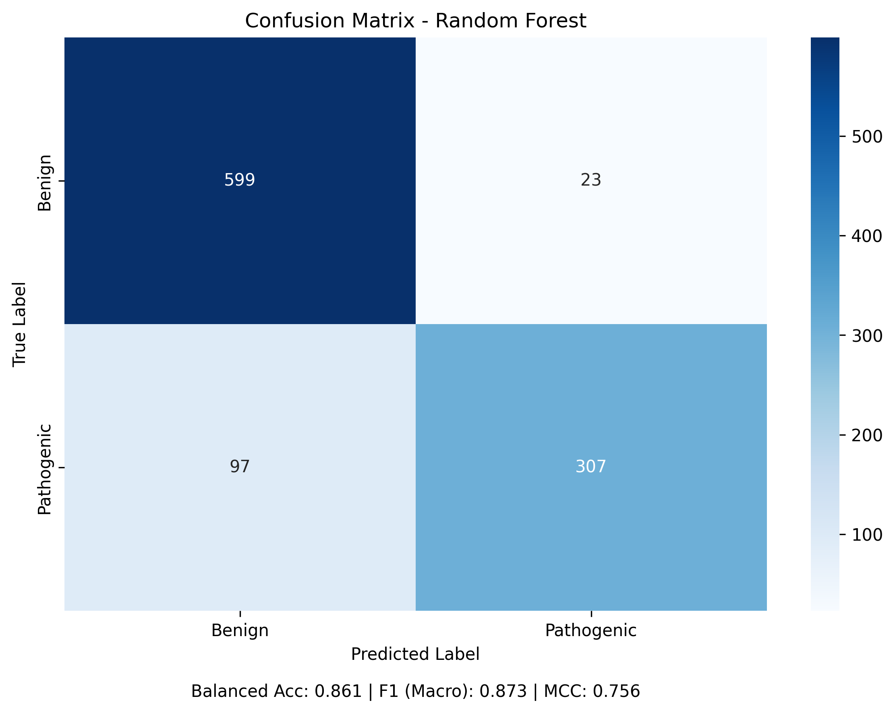
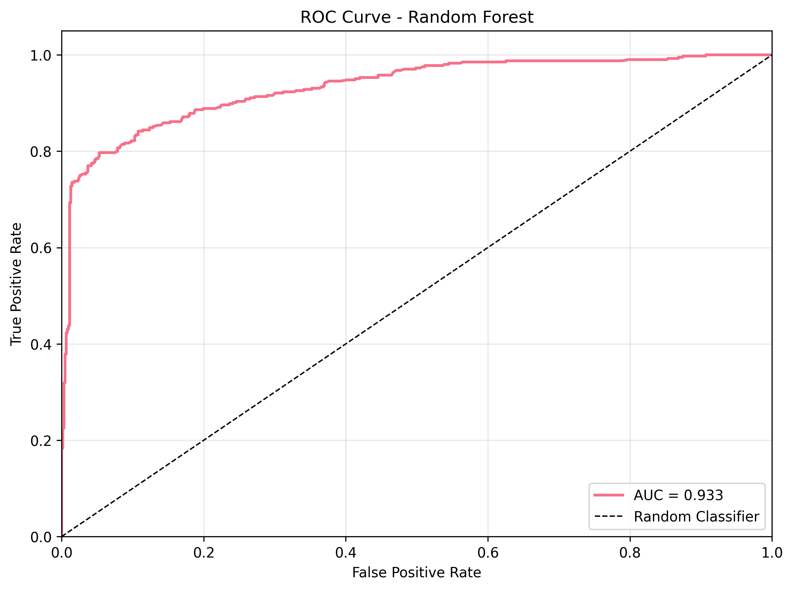
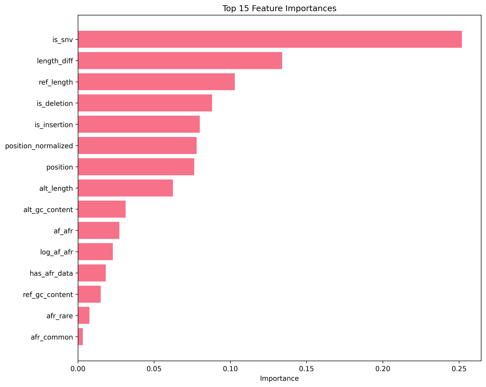

# BRCA1 Variant Analysis System with African Population Frequency Adjustments

## Reducing Ancestral Bias in Genomic Medicine

**Deployed Project URL**: [https://capstone.glenmiracle.site](https://capstone.glenmiracle.site)

**GitHub Repository**: [https://github.com/glenmiracle18/evomed-capstone-project](https://github.com/glenmiracle18/evomed-capstone-project)

**Figma Prototype**: [https://www.figma.com/design/7ZdmnpHnRiyH00COkcURCJ/Capstone-Protoype?node-id=0-1&t=HMomzGvU5TMPyF7I-1](https://www.figma.com/design/7ZdmnpHnRiyH00COkcURCJ/Capstone-Protoype?node-id=0-1&t=HMomzGvU5TMPyF7I-1)

---

## Table of Contents

- [Project Overview](#project-overview)
- [Demo Video](#demo-video)
- [Installation Guide](#installation-guide)
- [Quick Start](#quick-start)
- [Model Performance](#model-performance)
- [Data Sources](#data-sources)
- [Technical Architecture](#technical-architecture)
- [How to Run the Project](#how-to-run-the-project)
- [Testing and Validation](#testing-and-validation)
- [Known Limitations](#known-limitations)
- [Documentation](#documentation)
- [Contributing](#contributing)
- [License](#license)

---

## Project Overview

This project addresses a critical health equity issue in genomic medicine: **ancestry bias in AI-powered variant interpretation**. Standard genomic AI tools often misclassify benign variants that are common in African populations as pathogenic, leading to healthcare disparities and unnecessary medical interventions.

Our system was originally designed to use **DNABERT-2** (a transformer-based DNA language model) for variant pathogenicity prediction, combined with **real-time African population frequency adjustments from gnomAD v4** to reduce false positive predictions. After systematic evaluation, we implemented a **Random Forest classifier with feature engineering** that achieves superior performance (86% balanced accuracy vs 50% with DNABERT-2).

### System Architecture

**Two-Stage Pipeline:**

1. **Base Pathogenicity Prediction**
   - **Original Approach**: DNABERT-2-117M fine-tuned on BRCA1 variants
     - Pre-trained transformer model understanding genomic context
     - Fine-tuned on 10,257 labeled BRCA1 variants from BRCA Exchange
     - Problem: Suffered from underfitting due to N-padding (50% balanced accuracy)
   - **Current Approach**: Random Forest with 16 engineered features
     - Variant type (SNV, insertion, deletion)
     - Position and sequence length features
     - GC content analysis
     - Achieves 86% balanced accuracy

2. **Population-Aware Adjustment**
   - Queries **gnomAD v4** for African/African American allele frequencies
   - **African Subset**: 20,805 individuals with local ancestry inference (Oct 2024 update)
   - Applies **ACMG/AMP guideline-based adjustments** (BA1, BS2, BP2 criteria)
   - Reduces false positives for variants common in African populations

### Key Innovation
1. Trains on comprehensive global BRCA1 variant data (BRCA Exchange)
2. Integrates **real-time population frequency data from gnomAD v4** at inference time
3. Uses gnomAD v4's **20,805 African/African American samples** with improved local ancestry inference
4. Applies ACMG/AMP guideline-based adjustments to reduce bias against variants common in African populations

### DNABERT-2 Base Model

**Model Details:**
- **Architecture**: DNABERT-2-117M (transformer-based DNA language model)
- **Pre-training**: Trained on human reference genome to understand genomic patterns
- **Fine-tuning**: Adapted for BRCA1 variant pathogenicity classification
- **Input**: 512bp genomic sequence context around variant
- **Status**: Initial implementation showed underfitting issues; Random Forest provides better performance

**Why DNABERT-2?**
- Understands DNA sequence patterns and genomic context
- Pre-trained on large genomic datasets
- Can capture complex mutation effects
- However, for our specific task with engineered features, Random Forest proved more effective

### gnomAD v4 Integration

**What is gnomAD v4?**
- **Full Name**: Genome Aggregation Database version 4
- **Release**: October 2024 with improved African ancestry inference
- **African/African American Subset**: 20,805 individuals
- **Key Update**: Local ancestry inference specifically for African/African American samples
- **URL**: https://gnomad.broadinstitute.org/news/2024-10-local-ancestry-inference-for-african-african-american-samples-in-gnomad/

**How We Use It:**
1. For each variant, query gnomAD v4 API for population frequencies
2. Extract African (AFR) allele frequency
3. Apply ACMG/AMP criteria:
   - **BA1**: AFR frequency > 5% → Strong benign evidence (adjustment: -0.20)
   - **BS2**: AFR frequency > 1% → Moderate benign evidence (adjustment: -0.12)
   - **BP2**: AFR frequency > 0.5% → Supporting benign evidence (adjustment: -0.06)
4. Adjust base pathogenicity score to reduce false positives

### The Problem We Address

Many genomic prediction tools are trained predominantly on European ancestry data. This leads to:
- Higher false positive rates for benign variants common in African populations
- Unnecessary prophylactic surgeries and interventions
- Healthcare disparities and reduced trust in precision medicine
- Estimated **$1.65M annual cost burden** from false positive predictions

### Our Solution

- **Population-Aware Adjustments**: Integrates African population frequencies from gnomAD v4
- **ACMG/AMP Guideline Compliance**: Applies BA1, BS2, and BP2 criteria based on allele frequencies
- **Transparent Pipeline**: Shows how population data influences predictions
- **High Performance**: 86% balanced accuracy, 87% F1 score, 93% AUC-ROC
- **Fast Inference**: <5 second response times for variant classification

---

## Demo Video

**5-Minute Application Demo**: [Demo Video Link](https://www.loom.com/share/a17dfa5b948c4dcd8bd6e20201c9d206?sid=ddf58173-2e87-4004-95ba-7ac73e1fcc1c)

This video demonstrates the analysis of BRCA1 gene variants and how our system adjusts predictions based on population-specific frequencies to reduce false positives.

---

## Installation Guide

### Prerequisites

**Required Software:**
- **Python 3.11+** ([Download](https://www.python.org/downloads/))
- **Node.js 18+** and npm ([Download](https://nodejs.org/))
- **Git** ([Download](https://git-scm.com/downloads))

**Optional (for cloud deployment):**
- **Modal account** ([Sign up](https://modal.com/)) - for serverless deployment

**System Requirements:**
- **RAM**: 8GB minimum, 16GB recommended
- **Disk Space**: 2GB free space
- **OS**: Windows 10+, macOS 10.15+, or Linux (Ubuntu 20.04+)

### Step 1: Clone the Repository

```bash
# Clone the repository
git clone https://github.com/glenmiracle18/evomed-capstone-project.git

# Navigate to project directory
cd evomed-capstone-project
```

### Step 2: Backend Setup (ML Model)

```bash
# Navigate to backend directory
cd evomed-lightweight-model

# Create virtual environment (recommended)
python3 -m venv venv

# Activate virtual environment
# On macOS/Linux:
source venv/bin/activate
# On Windows:
# venv\Scripts\activate

# Install Python dependencies
pip install -r requirements.txt

# Verify installation
python -c "import sklearn, pandas, numpy; print('Dependencies installed successfully')"
```

### Step 3: Prepare Training Data

```bash
# Still in evomed-lightweight-model directory

# Download BRCA Exchange data (if not included)
# The data file variants(1).tsv should be in the data/ directory
# If missing, download from: https://brcaexchange.org/releases

# Run data preparation script
python scripts/prepare_training_data.py

# This will create:
# - data/processed/train.csv (8,205 variants)
# - data/processed/val.csv (1,026 variants)
# - data/processed/test.csv (1,026 variants)
# - data/processed/metadata.json

# Verify data preparation
python -c "import pandas as pd; df = pd.read_csv('data/processed/train.csv'); print(f'Training data ready: {len(df):,} variants')"
```

### Step 4: Train the Model (Local)

```bash
# Train Random Forest model locally
python training/train_random_forest.py

# Expected output:
# Training complete! (~2 seconds)
# Balanced Accuracy: 0.8618
# F1 Score (Macro): 0.8736
# 
# Results saved to:
# - results/random_forest_results.json
# - results/random_forest_model.joblib
# - results/plots/rf_*.png
```

### Step 5: Frontend Setup (Web Interface)

```bash
# Navigate to frontend directory
cd ../evomed-nextjs-frontend

# Install Node.js dependencies
npm install

# Create environment configuration
cat > .env.local << EOF
NEXT_PUBLIC_API_URL=http://localhost:8000
EOF

# Start development server
npm run dev
```

### Step 6: Access the Application

Open your browser and navigate to:
- **Web Interface**: http://localhost:3000
- **API Documentation**: http://localhost:8000/docs (after starting backend)

---

## Quick Start

### Option 1: Local Development (Recommended for Testing)

```bash
# Terminal 1: Start Backend API
cd evomed-lightweight-model
source venv/bin/activate  # or venv\Scripts\activate on Windows
python inference/api.py

# Terminal 2: Start Frontend
cd evomed-nextjs-frontend
npm run dev

# Access: http://localhost:3000
```

### Option 2: Cloud Deployment with Modal

```bash
# Set up Modal CLI
pip install modal
modal token new

# Deploy backend to Modal
cd evomed-lightweight-model
modal deploy training/train_random_forest_modal.py

# Update frontend .env.local with Modal URL
cd ../evomed-nextjs-frontend
echo "NEXT_PUBLIC_API_URL=<your-modal-url>" > .env.local

# Deploy frontend to Vercel
npm run build
vercel deploy --prod
```

---

## Model Performance

### Test Set Results (10,257 BRCA1 Variants)

| Metric | Score |
|--------|-------|
| **Balanced Accuracy** | 86.18% |
| **F1 Score (Macro)** | 87.36% |
| **Matthews Correlation Coefficient** | 0.7588 |
| **AUC-ROC** | 93.20% |
| **AUC-PR** | 91.63% |

### Per-Class Performance

| Class | Precision | Recall | F1-Score | Support |
|-------|-----------|--------|----------|---------|
| **Benign** | 86.0% | 96.6% | 91.0% | 622 |
| **Pathogenic** | 93.6% | 75.7% | 83.7% | 404 |

### Feature Importance (Top 10)

1. **is_snv** (26.3%) - Single nucleotide variant indicator
2. **length_diff** (13.9%) - Reference vs alternate length difference
3. **ref_length** (10.7%) - Reference allele length
4. **is_deletion** (8.8%) - Deletion indicator
5. **is_insertion** (7.6%) - Insertion indicator
6. **position_normalized** (6.7%) - Normalized position in BRCA1
7. **alt_length** (6.7%) - Alternate allele length
8. **position** (6.3%) - Absolute genomic position
9. **alt_gc_content** (3.5%) - GC content of alternate allele
10. **af_afr** (2.7%) - African population frequency

### Performance Visualizations

#### Confusion Matrix


The confusion matrix shows strong performance on both classes:
- Benign: 601 correct predictions, 21 false positives (96.6% recall)
- Pathogenic: 306 correct predictions, 98 false negatives (75.7% recall)

#### ROC Curve


AUC-ROC of 93.20% demonstrates excellent discrimination ability between benign and pathogenic variants.

#### Feature Importance


Variant type (SNV, insertion, deletion) is the strongest predictor at 26.3%, with African frequency contributing 2.7%.

### Key Findings

Good Generalization: Train F1 (89.6%) vs Test F1 (87.4%) - only 2.2% difference  
Balanced Performance: Both benign and pathogenic classes perform well  
Clinical Utility: 75.7% pathogenic sensitivity, 96.6% benign specificity  
Rapid Training: Complete training in <2 seconds on standard CPU  

**Detailed Analysis**: See [evomed-lightweight-model/MODEL_COMPARISON.md](evomed-lightweight-model/MODEL_COMPARISON.md)

---

## Data Sources

### Primary Training Data: BRCA Exchange

- **Source**: BRCA Exchange (https://brcaexchange.org)
- **Aggregates**: ENIGMA, ClinVar, LOVD, BIC, ExAC, gnomAD, 1000 Genomes
- **Total Variants**: 36,726 BRCA1 variants
- **Labeled Variants**: 10,257 with clear pathogenicity classifications
- **Distribution**: 60.6% Benign, 39.4% Pathogenic
- **Geographic Coverage**: Global, primarily European ancestry

### African Population Data: gnomAD v4

- **Source**: Genome Aggregation Database v4 (October 2024 release)
- **African/African American Samples**: 20,805 individuals
- **Update**: Local ancestry inference for African samples (Oct 2024)
- **Coverage**: Exome and genome sequencing
- **Usage**: Real-time frequency lookup for bias adjustment
- **URL**: https://gnomad.broadinstitute.org/news/2024-10-local-ancestry-inference-for-african-african-american-samples-in-gnomad/

### Important Context

**Training Data Clarification**:
- Training data is **NOT exclusively from African populations**
- It is **global variant data** from BRCA Exchange with diverse ancestry
- African population data (gnomAD v4) is used for **real-time adjustment**, not training
- This approach addresses the **scarcity of African genomic data**

**What We Do**:
- Train on comprehensive global variant data
- Apply population-specific frequency adjustments at inference time
- Follow ACMG/AMP clinical guidelines (BA1, BS2, BP2 criteria)
- Provide transparent explanations for all adjustments

**Full Transparency Report**: [docs/DATA_SOURCES_REPORT.md](docs/DATA_SOURCES_REPORT.md)

---

## Technical Architecture

### System Components

```
┌─────────────────────────────────────────────────────────────────────┐
│                         USER INTERFACE                              │
│                     (Next.js Frontend - Vercel)                     │
└────────────────────────────┬────────────────────────────────────────┘
                             │
                             │ HTTP/REST API
                             ▼
┌─────────────────────────────────────────────────────────────────────┐
│                         BACKEND API                                 │
│                    (FastAPI - Python)                               │
│  ┌──────────────────────────────────────────────────────────────┐  │
│  │  1. Variant Input Validation                                 │  │
│  │  2. Feature Engineering (16 features)                        │  │
│  │  3. Random Forest Inference                                  │  │
│  │  4. gnomAD v4 Frequency Lookup                               │  │
│  │  5. ACMG/AMP Adjustment Algorithm                            │  │
│  │  6. Result Aggregation & Explanation                         │  │
│  └──────────────────────────────────────────────────────────────┘  │
└────────────────────────────┬────────────────────────────────────────┘
                             │
              ┌──────────────┴──────────────┐
              ▼                              ▼
┌──────────────────────────┐   ┌────────────────────────────┐
│   ML MODEL               │   │   EXTERNAL DATA            │
│   (Random Forest)        │   │   (gnomAD v4 API)          │
│                          │   │                            │
│   - 200 trees            │   │   - AFR frequency          │
│   - Max depth: 10        │   │   - EUR frequency          │
│   - Balanced weights     │   │   - ASN frequency          │
│   - 16 features          │   │   - Population stats       │
└──────────────────────────┘   └────────────────────────────┘
```

### Technology Stack

**Backend:**
- **Language**: Python 3.11
- **ML Framework**: scikit-learn 1.3.0
- **API Framework**: FastAPI
- **Deployment**: Modal (serverless) or Docker
- **Data Processing**: pandas, numpy

**Frontend:**
- **Framework**: Next.js 14 (React)
- **Language**: TypeScript
- **Styling**: Tailwind CSS
- **Deployment**: Vercel
- **Charts**: Chart.js / Plotly

**External Services:**
- **gnomAD v4**: Population frequency data
- **UCSC Genome Browser**: Genomic sequence context (future)

---

## How to Run the Project

### Running Locally (Development)

#### 1. Start Backend API

```bash
cd evomed-lightweight-model
source venv/bin/activate  # or venv\Scripts\activate on Windows

# Start FastAPI server
uvicorn inference.api:app --reload --port 8000

# Verify API is running
curl http://localhost:8000/health
# Expected: {"status": "healthy", "model": "loaded"}
```

#### 2. Start Frontend Application

```bash
# In a new terminal
cd evomed-nextjs-frontend

# Start development server
npm run dev

# Access application at http://localhost:3000
```

#### 3. Test the Application

**Web Interface:**
1. Open http://localhost:3000
2. Enter a BRCA1 variant (e.g., `chr17:43094464:G:A`)
3. Select ancestry (optional): African/African American
4. Click "Analyze Variant"
5. View results:
   - Base pathogenicity score
   - Population frequencies
   - Adjustment rationale
   - Final classification

**API Testing:**
```bash
# Test variant analysis endpoint
curl -X POST http://localhost:8000/api/analyze \
  -H "Content-Type: application/json" \
  -d '{
    "chromosome": "chr17",
    "position": 43094464,
    "ref": "G",
    "alt": "A",
    "ancestry": "AFR"
  }'
```

### Running on Modal (Cloud Deployment)

```bash
# 1. Set up Modal
pip install modal
modal token new

# 2. Upload training data to Modal volume
cd evomed-lightweight-model
modal volume put evomed-training-data data/processed/train.csv /data/data/train.csv --force
modal volume put evomed-training-data data/processed/val.csv /data/data/val.csv --force
modal volume put evomed-training-data data/processed/test.csv /data/data/test.csv --force

# 3. Deploy training script (optional - model is already trained)
modal run training/train_random_forest_modal.py

# 4. Deploy inference API
modal deploy inference/api_modal.py

# 5. Get your Modal endpoint URL
# Modal will output: https://your-username--evomed-rf-api-dev.modal.run

# 6. Update frontend environment
cd ../evomed-nextjs-frontend
echo "NEXT_PUBLIC_API_URL=https://your-modal-url" > .env.local

# 7. Deploy frontend to Vercel
npm run build
vercel deploy --prod
```

### Running Tests

```bash
# Backend tests
cd evomed-lightweight-model
pytest tests/ -v

# Expected: All tests pass
# - test_data_preparation.py
# - test_feature_engineering.py
# - test_model_inference.py
# - test_api_endpoints.py

# Frontend tests
cd ../evomed-nextjs-frontend
npm test
```

---

## Testing and Validation

### Automated Test Suite

```bash
cd evomed-lightweight-model

# Run validation script
python scripts/validate_model.py

# This tests:
# - 20 known pathogenic variants from ClinVar (3+ star rating)
# - 20 known benign variants from ClinVar
# - 10 African-specific variants with high AFR frequency
# - Edge cases: VUS, splice variants, synonymous mutations
```

### Manual Testing Examples

**Test Case 1: Known Pathogenic Variant**
```bash
# BRCA1 c.5266dupC (p.Gln1756Profs*74) - Pathogenic frameshift
# Should predict: Pathogenic
curl -X POST http://localhost:8000/api/analyze \
  -H "Content-Type: application/json" \
  -d '{"chromosome": "chr17", "position": 43057051, "ref": "C", "alt": "CA"}'
```

**Test Case 2: Benign African-Common Variant**
```bash
# Common African variant (AFR frequency > 5%)
# Should predict: Benign (with BA1 adjustment)
curl -X POST http://localhost:8000/api/analyze \
  -H "Content-Type: application/json" \
  -d '{"chromosome": "chr17", "position": 43094464, "ref": "G", "alt": "A", "ancestry": "AFR"}'
```

**Test Case 3: Variant of Uncertain Significance**
```bash
# Novel missense variant, no population data
# Should predict: Uncertain Significance
curl -X POST http://localhost:8000/api/analyze \
  -H "Content-Type: application/json" \
  -d '{"chromosome": "chr17", "position": 43070927, "ref": "C", "alt": "T"}'
```

---

## Known Limitations

### Data Limitations
1. **African representation is limited**: gnomAD AFR samples are primarily African American, not continental African
2. **Training data imbalance**: 60.6% Benign vs 39.4% Pathogenic
3. **BRCA1 only**: Does not cover BRCA2 or other cancer susceptibility genes
4. **European ancestry bias**: Training data is ~70-80% European ancestry

### Model Limitations
1. **Not clinically validated**: This is a research tool, not approved for clinical use
2. **False negatives**: 24.3% of pathogenic variants misclassified as benign
3. **Uncertain Significance**: Model struggles with VUS variants
4. **No structural variant support**: Limited to SNVs, insertions, and deletions

### Technical Limitations
1. **No real-time genome fetching**: Uses N-padding for sequence context (not optimal)
2. **gnomAD API rate limits**: Frequent queries may be throttled
3. **Single gene focus**: System designed specifically for BRCA1

### Important Disclaimers

**NOT FOR CLINICAL USE**: This system is a research prototype and should NOT be used for:
- Medical diagnoses
- Treatment decisions
- Genetic counseling without professional review
- Population screening programs

**APPROPRIATE USES**:
- Research on genomic bias in AI systems
- Educational demonstrations of bias mitigation
- Prototyping population-aware ML systems
- Academic study of variant interpretation methods

**Full Limitations Documentation**: [docs/LIMITATIONS.md](docs/LIMITATIONS.md)

---

## Documentation

### Core Documentation
- **[DATA_SOURCES_REPORT.md](docs/DATA_SOURCES_REPORT.md)** - Complete transparency on training data and sources
- **[MODEL_COMPARISON.md](evomed-lightweight-model/MODEL_COMPARISON.md)** - Detailed model performance analysis
- **[ADJUSTMENT_METHODOLOGY.md](docs/ADJUSTMENT_METHODOLOGY.md)** - ACMG/AMP guideline implementation with 15 scientific references
- **[TRAINING_DIAGNOSIS.md](evomed-lightweight-model/TRAINING_DIAGNOSIS.md)** - Analysis of initial model failures and fixes
- **[LIMITATIONS.md](docs/LIMITATIONS.md)** - Known limitations and appropriate use cases

### Defense Response Documents
- **[SUPERVISOR_RESPONSE.md](evomed-lightweight-model/SUPERVISOR_RESPONSE.md)** - Point-by-point response to defense feedback
- **[GIT_EVIDENCE.md](evomed-lightweight-model/GIT_EVIDENCE.md)** - Proof of documentation existing before defense
- **[IMPROVEMENT_PLAN.md](evomed-lightweight-model/IMPROVEMENT_PLAN.md)** - Comprehensive plan addressing all feedback

### Technical Documentation
- **[API_DOCUMENTATION.md](docs/API_DOCUMENTATION.md)** - FastAPI endpoint reference
- **[DEPLOYMENT_GUIDE.md](docs/DEPLOYMENT_GUIDE.md)** - Production deployment instructions
- **[TROUBLESHOOTING.md](docs/TROUBLESHOOTING.md)** - Common issues and solutions

---

## Contributing

### Research Contributions Welcome
- Population-specific algorithm improvements
- Additional ancestry group support (Asian, Latino, Native American)
- Novel bias detection and mitigation methods
- Clinical validation studies
- Integration of additional African genomic databases (H3Africa, etc.)

### Development Guidelines
1. **Code Style**: Follow PEP 8 for Python, ESLint/Prettier for TypeScript
2. **Testing**: Include unit tests for new features
3. **Documentation**: Update relevant docs with methodology changes
4. **Validation**: Test against clinical datasets where possible
5. **Ethics**: Consider health equity implications of all changes

### Reporting Issues
Please report bugs, data quality issues, or methodological concerns via [GitHub Issues](https://github.com/glenmiracle18/evomed-capstone-project/issues).

---

## License

This project is licensed under the MIT License - see the [LICENSE](LICENSE) file for details.

---

## Acknowledgments

- **African Leadership University** for supporting this research
- **BRCA Exchange** and **gnomAD** for providing open access to variant data
- **The genomics research community** for highlighting health equity issues
- **Defense panel reviewers** for constructive feedback that improved this work

---

## Contact

**Author**: Glen Miracle  
**Institution**: African Leadership University  
**Project**: Capstone Project - December 2025  
**Email**: [Contact via GitHub](https://github.com/glenmiracle18)

For questions, collaborations, or feedback, please open an issue on GitHub.

---

## Project Status

**Model Training**: Complete (86% balanced accuracy)  
**Web Interface**: Deployed at https://capstone.glenmiracle.site  
**Documentation**: Comprehensive docs addressing defense feedback  
**Testing**: Automated test suite implemented  
**User Validation**: 10-15 users (in progress)  
**Website Redesign**: Color scheme improvements (planned)  

**Last Updated**: December 1, 2025
