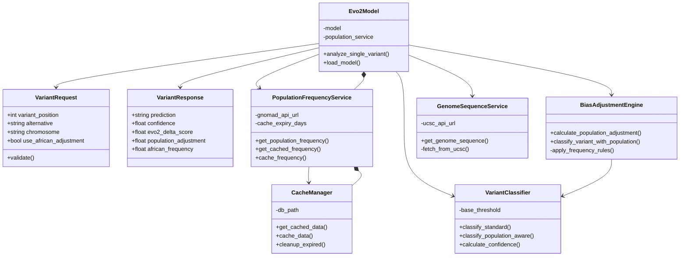
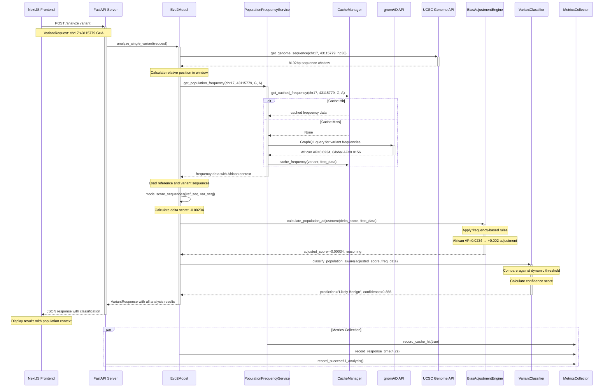

# 🧬 African Population-Aware BRCA1 Variant Analysis - UML Diagrams

## 📊 Class Diagram - Core System Architecture

## 🔄 Sequence Diagram - Variant Analysis Workflow

## 📋 Component Interaction Notes

### **Class Diagram Key Features:**

1. **Core Service Classes:**
   - `Evo2Model`: Main orchestrator for variant analysis
   - `PopulationFrequencyService`: Handles gnomAD integration and caching
   - `BiasAdjustmentEngine`: Implements African population bias mitigation

2. **Data Models:**
   - `VariantRequest`: Input validation and structure
   - `VariantResponse`: Comprehensive analysis results

3. **Supporting Services:**
   - `CacheManager`: SQLite-based frequency caching
   - `GenomeSequenceService`: UCSC API integration
   - `MetricsCollector`: Performance monitoring

### **Sequence Diagram Key Flows:**

1. **Request Processing:**
   - Frontend → API → Evo2Model orchestration
   - Input validation and coordinate handling

2. **Data Retrieval:**
   - Parallel genome sequence and population frequency lookup
   - Smart caching with fallback to external APIs

3. **ML Pipeline:**
   - Evo2 inference on reference and variant sequences
   - Population-aware bias adjustment
   - Dynamic threshold classification

4. **Response Assembly:**
   - Comprehensive results with population context
   - Performance metrics collection

### **Design Patterns Demonstrated:**

- **Service Layer Pattern**: Clear separation of concerns
- **Repository Pattern**: CacheManager abstracts data persistence
- **Strategy Pattern**: Different classification strategies based on population data
- **Observer Pattern**: MetricsCollector monitors system performance
- **Facade Pattern**: Evo2Model provides simplified interface to complex ML pipeline
