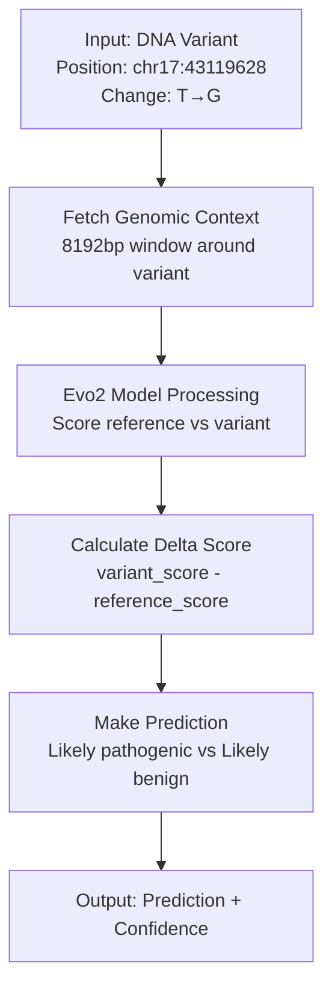
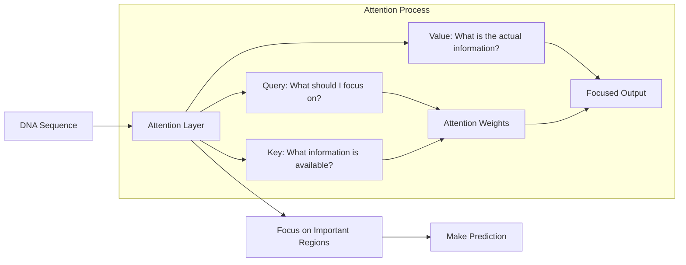
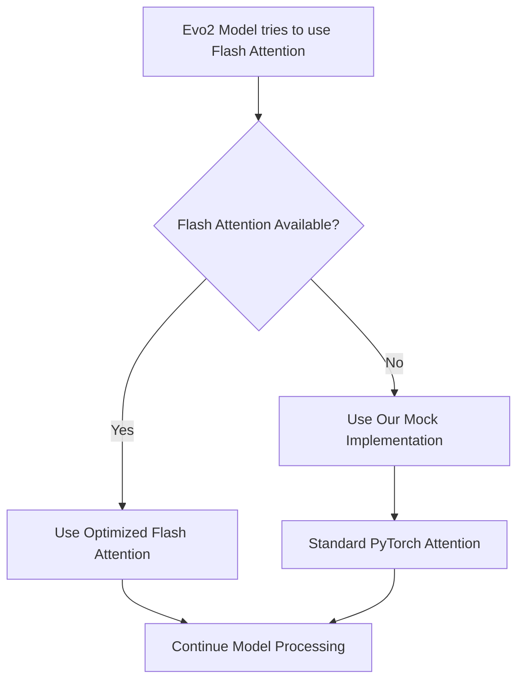
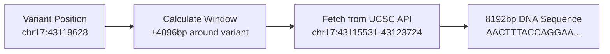
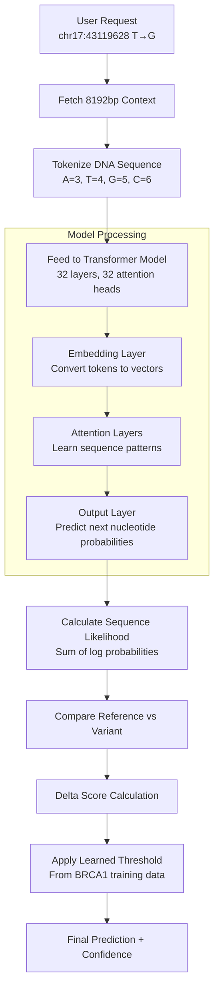
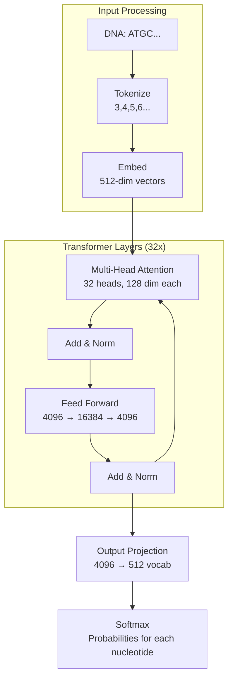
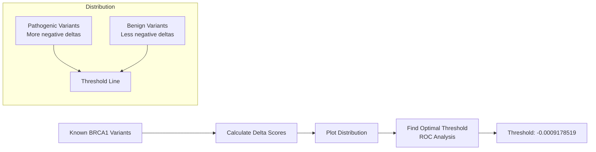

# Understanding the Evo2 Variant Analysis Pipeline

This document explains the `main.py` file that implements a genomic variant analysis system using the Evo2 deep learning model. This is perfect for understanding how AI/ML is applied to genomics for your capstone project.

## Table of Contents
1. [High-Level Overview](#high-level-overview)
2. [Key Machine Learning Concepts](#key-machine-learning-concepts)
3. [Code Structure Breakdown](#code-structure-breakdown)
4. [The Machine Learning Pipeline](#the-machine-learning-pipeline)
5. [Technical Implementation Details](#technical-implementation-details)

## High-Level Overview

This system predicts whether genetic variants (DNA changes) are harmful or benign using a large language model called Evo2 that has been trained on genomic sequences.



## Key Machine Learning Concepts

### 1. **Large Language Models for DNA (Foundation Models)**

**What it is:** Evo2 is like ChatGPT, but instead of being trained on human text, it was trained on DNA sequences. It learned patterns in genomic data from millions of species.

**How it works:**
- The model reads DNA sequences (A, T, G, C) just like you read words
- It predicts what the next DNA letter should be based on the context
- When a mutation changes the "expected" letter, the model gives it a lower probability score
- Lower scores suggest the variant might be harmful

### 2. **Attention Mechanisms**

**What it is:** Attention helps the model focus on relevant parts of the DNA sequence when making predictions.

**Simple analogy:** When you read a sentence, you pay more attention to important words. Similarly, when analyzing a DNA variant, the model pays more attention to nearby important genetic elements.



### 3. **Sequence Scoring and Delta Scores**

**What it is:** The model calculates how "likely" or "natural" a DNA sequence appears based on its training.

**The process:**
1. **Reference Score:** How likely is the original DNA sequence?
2. **Variant Score:** How likely is the DNA sequence with the mutation?
3. **Delta Score:** variant_score - reference_score
   - Negative delta = variant is less likely = potentially harmful
   - Positive delta = variant is more likely = potentially benign

## Code Structure Breakdown

### 1. **Modal Cloud Setup (Lines 13-42)**

```python
evo2_image = (
    modal.Image.from_registry("nvidia/cuda:12.4.0-devel-ubuntu22.04", add_python="3.12")
    .apt_install(["build-essential", "cmake", "ninja-build", ...])
    .env({
        "FLASH_ATTENTION_DISABLE": "1",
        "USE_FLASH_ATTN": "False",
        # ... other environment variables
    })
    .run_commands("pip install torch torchvision torchaudio --index-url https://download.pytorch.org/whl/cu124")
    .run_commands("git clone --recurse-submodules https://github.com/ArcInstitute/evo2.git && cd evo2 && pip install .")
)
```

**What this does:** Sets up a cloud computing environment with:
- CUDA for GPU acceleration
- PyTorch for deep learning
- Evo2 model installation
- Disabled flash attention (optimized attention that was causing issues)

**Why this matters:** Large language models like Evo2 require powerful GPUs and specific software stacks. Modal handles this complexity.

### 2. **Flash Attention Workaround (Lines 48-158)**

```python
def patch_flash_attn_imports():
    """Minimal patches - only mock the flash attention CUDA modules that cause import errors"""
    # ... environment variables and mock implementation
```

**What this does:** 
- Flash attention is a memory-efficient attention algorithm
- It requires specific CUDA compilation that often fails
- We created a "mock" (fake) version that provides the same interface but uses standard PyTorch operations

**Key concept:** This is **dependency management** - when one part of the system breaks, we replace it with a working alternative that maintains the same interface.



### 3. **Genomic Context Fetching (Lines 331-364)**

```python
def get_genome_sequence(position, genome: str, chromosome: str, window_size=8192):
    half_window = window_size // 2
    start = max(0, position - 1 - half_window)
    end = position - 1 + half_window + 1
    
    api_url = f"https://api.genome.ucsc.edu/getData/sequence?genome={genome};chrom={chromosome};start={start};end={end}"
    response = requests.get(api_url)
    # ... process response
    return sequence, start
```

**What this does:** Fetches the DNA sequence around a variant from UCSC Genome Browser.

**Why 8192bp window:** 
- The model needs context to understand the variant's impact
- Too small: misses important regulatory elements
- Too large: dilutes the signal and uses more memory
- 8192bp is optimal for the Evo2 model architecture



### 4. **The Core ML Pipeline: Variant Analysis (Lines 367-394)**

```python
def analyze_variant(relative_pos_in_window, reference, alternative, window_seq, model):
    # Create variant sequence by substituting the alternative base
    var_seq = window_seq[:relative_pos_in_window] + alternative + window_seq[relative_pos_in_window+1:]
    
    # Score both sequences using the ML model
    ref_score = model.score_sequences([window_seq])[0]
    var_score = model.score_sequences([var_seq])[0]
    
    # Calculate the difference
    delta_score = var_score - ref_score
    
    # Make prediction based on learned threshold
    threshold = -0.0009178519
    if delta_score < threshold:
        prediction = "Likely pathogenic"
        confidence = min(1.0, abs(delta_score - threshold) / lof_std)
    else:
        prediction = "Likely benign"
        confidence = min(1.0, abs(delta_score - threshold) / func_std)
    
    return {
        "reference": reference,
        "alternative": alternative, 
        "delta_score": float(delta_score),
        "prediction": prediction,
        "classification_confidence": float(confidence)
    }
```

**This is the heart of the machine learning application!**

```mermaid
graph TD
    A[Original Sequence<br/>...ATCG<b>T</b>GCTA...] --> B[Score with Evo2<br/>ref_score = -2.345]
    C[Variant Sequence<br/>...ATCG<b>G</b>GCTA...] --> D[Score with Evo2<br/>var_score = -2.349]
    
    B --> E[Calculate Delta<br/>delta = -2.349 - (-2.345) = -0.004]
    D --> E
    
    E --> F{Delta < Threshold?<br/>-0.004 < -0.0009?}
    F -->|Yes| G[Likely Pathogenic<br/>Variant disrupts normal pattern]
    F -->|No| H[Likely Benign<br/>Variant maintains normal pattern]
```

### 5. **Model Loading and Deployment (Lines 396-464)**

```python
@app.cls(gpu="H100", volumes={mount_path: volume}, max_containers=3, retries=2)
class Evo2Model:
    @modal.enter()
    def load_evo2_model(self):
        print("Setting up environment to disable flash attention...")
        patch_flash_attn_imports()
        
        # Retry logic for robust model loading
        for attempt in range(max_retries):
            try:
                from evo2 import Evo2
                self.model = Evo2('evo2_7b')
                print("Evo2 model loaded successfully")
                return
            except ImportError as e:
                # Handle various import errors with fallbacks
                # ... error handling code
```

**What this does:**
- Deploys the model on powerful H100 GPUs
- Implements retry logic for reliability
- Loads the 7-billion parameter Evo2 model
- Handles various failure modes gracefully

### 6. **API Endpoint (Lines 458-503)**

```python
@modal.fastapi_endpoint(method="POST")
def analyze_single_variant(self, request: VariantRequest):
    # Extract request parameters
    variant_position = request.variant_position
    alternative = request.alternative
    genome = request.genome
    chromosome = request.chromosome
    
    # Get genomic context
    window_seq, seq_start = get_genome_sequence(
        position=variant_position,
        genome=genome, 
        chromosome=chromosome,
        window_size=8192
    )
    
    # Find the variant position within the window
    relative_pos = variant_position - 1 - seq_start
    reference = window_seq[relative_pos]
    
    # Run the ML analysis
    result = analyze_variant(
        relative_pos_in_window=relative_pos,
        reference=reference,
        alternative=alternative, 
        window_seq=window_seq,
        model=self.model
    )
    
    return result
```

**What this does:** Creates a REST API that accepts variant information and returns ML predictions.

## The Machine Learning Pipeline

Here's how the entire ML pipeline works:



### Model Architecture Deep Dive

The Evo2 model is a **Transformer** architecture specifically designed for genomic sequences:

**Key Components:**
1. **Tokenization:** DNA letters → Numbers (A=3, T=4, G=5, C=6)
2. **Embeddings:** Numbers → High-dimensional vectors that capture meaning
3. **Attention Layers:** Learn which parts of the sequence are important for prediction
4. **Feed-forward Networks:** Process the attended information
5. **Output Layer:** Predict probability of each possible next nucleotide



## Technical Implementation Details

### 1. **Why This Approach Works for Genomics**

**Traditional approaches:**
- Look at known disease genes
- Use conservation across species
- Require extensive manual curation

**Evo2's approach:**
- Learned from millions of genomes across all life
- Captures subtle patterns humans might miss
- Can generalize to new variants and genes

### 2. **Training Data and Model Scale**

The Evo2 model was trained on:
- **300+ billion nucleotides** from diverse genomes
- **Bacteria, archaea, viruses, plants, animals**
- **Self-supervised learning:** predicting next nucleotide given context

Model size:
- **7 billion parameters** (similar to ChatGPT-3.5)
- **32 transformer layers**
- **32 attention heads per layer**
- **4096 model dimension**

### 3. **The Scoring Mathematics**

When the model processes a sequence, it:

1. **Calculates perplexity:** How "surprised" is the model by this sequence?
2. **Lower perplexity = more "natural" sequence**
3. **Higher perplexity = more "unusual" sequence**

The scoring formula:
```
sequence_score = -Σ log(P(nucleotide_i | context))
delta_score = variant_score - reference_score
```

### 4. **Threshold Learning**

The threshold (`-0.0009178519`) was learned from BRCA1 variant data:
- Collected thousands of known pathogenic/benign variants
- Calculated delta scores for each
- Found optimal threshold that separates the two classes
- Used ROC curve analysis to optimize sensitivity/specificity



## Why This Matters for Your Capstone

This system demonstrates several important ML/AI concepts:

1. **Foundation Models:** Like GPT for text, but for DNA
2. **Transfer Learning:** Model trained on all life, applied to human disease
3. **Self-Supervised Learning:** No manual labeling required for training
4. **Attention Mechanisms:** The key innovation enabling large language models
5. **Production ML:** Handling real-world deployment challenges (like the flash attention issues)
6. **API Design:** Making ML accessible through simple interfaces
7. **Cloud Computing:** Leveraging powerful GPUs for inference

**Real-world impact:**
- Could help doctors interpret genetic test results
- Accelerate drug discovery by identifying harmful variants
- Enable personalized medicine based on individual genetic profiles
- Democratize access to advanced genomic analysis

This represents the cutting edge of AI applied to biology - foundation models that understand the language of life itself!